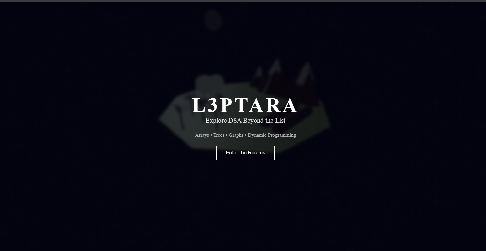
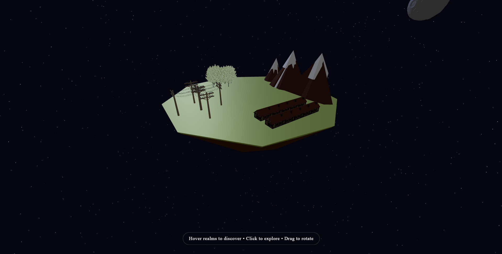

# 🌍 L3PTARA

> **Explore Data Structures & Algorithms through an interactive 3D world.**

L3PTARA reimagines DSA learning by replacing traditional lists with an immersive 3D floating island. Each realm represents a core DSA topic, allowing users to explore concepts visually before jumping into relevant coding problems.

## 🌐 Live Demo

🔗 https://l3-ptara.vercel.app/

---

## ✨ Features

- 🌍 Interactive 3D floating island
- 🌌 Animated night sky with stars and orbiting moon
- 🌊 Floating world animation
- 🌲 Four unique DSA realms:
  - Trees
  - Arrays
  - Graphs
  - Dynamic Programming
- 🖱️ Hover labels and visual highlights
- 🚪 Animated introduction screen
- 📖 In-world interaction guide
- 🔗 Direct navigation to relevant LeetCode problem collections
- 🎮 Smooth orbit controls for exploring the world

---

## 🛠️ Tech Stack

- React
- Vite
- Three.js
- React Three Fiber
- Drei
- JavaScript

---

## 🚀 Getting Started

Clone the repository:

```bash
git clone https://github.com/pratapaditya059-cell/L3PTARA
cd L3PTARA
```

Install dependencies:

```bash
npm install
```

Run the development server:

```bash
npm run dev
```

Build for production:

```bash
npm run build
```

Preview the production build:

```bash
npm run preview
```

---

## 🎯 Current Realms

🌲 **Trees Realm**

Explore tree-based DSA problems.

🏘️ **Arrays Realm**

Practice array and traversal problems.

⚡ **Graphs Realm**

Navigate graph algorithms and traversals.

🏔️ **Dynamic Programming Realm**

Solve state-based optimization problems.

---

## 💡 Vision

L3PTARA aims to make learning DSA more engaging by combining interactive 3D environments with problem-solving.

Instead of navigating endless lists, users discover topics naturally by exploring different regions of a virtual world.

Future versions will include:

- Player movement
- Quest-based progression
- Curated learning paths
- Progress tracking
- Additional DSA realms
- Animations and environmental effects

---

## 📸 Preview




---

## 📄 License

This project is licensed under the MIT License.

Third-party 3D assets are used under their respective licenses.